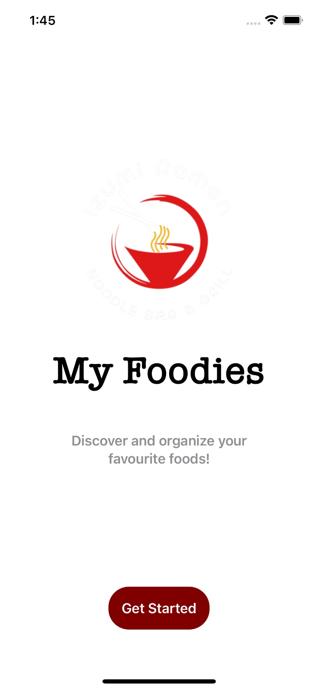
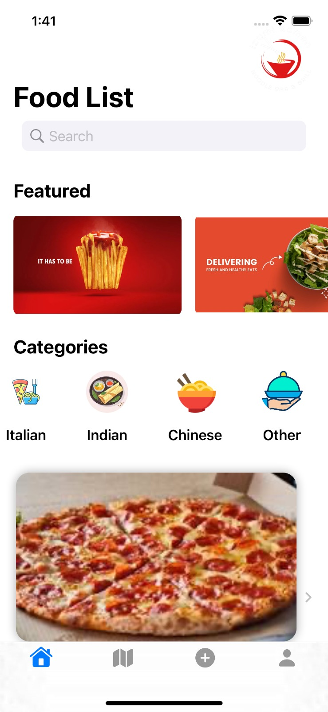
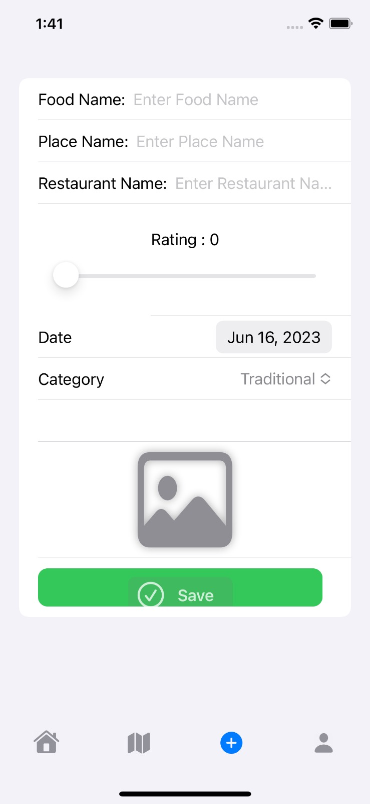
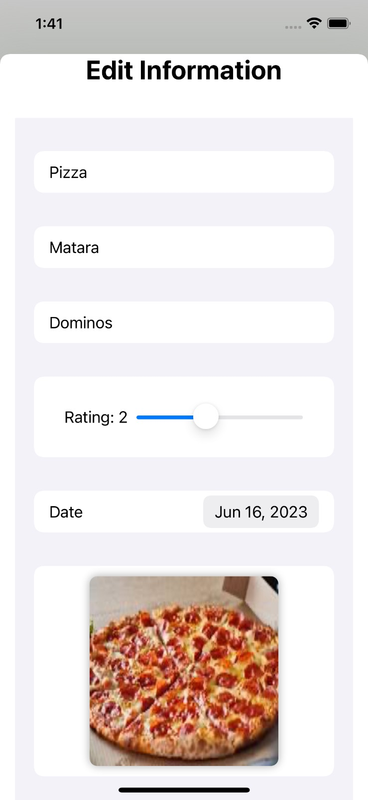
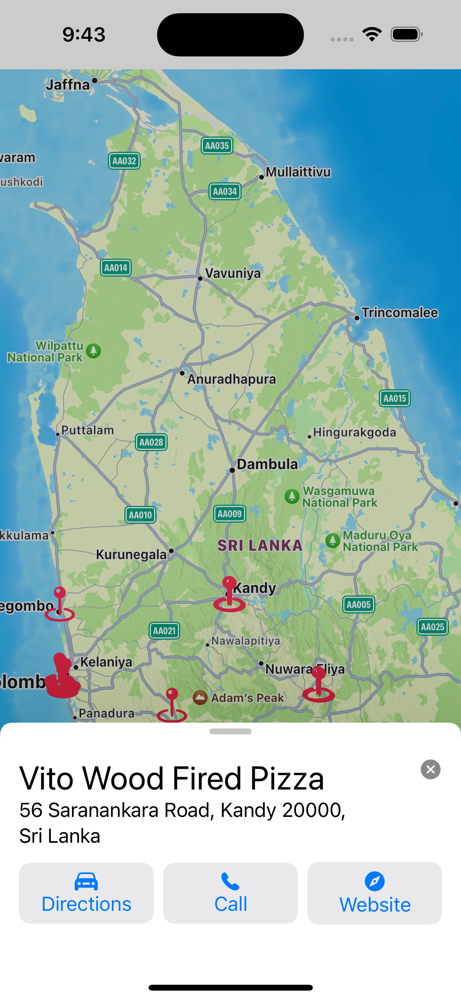
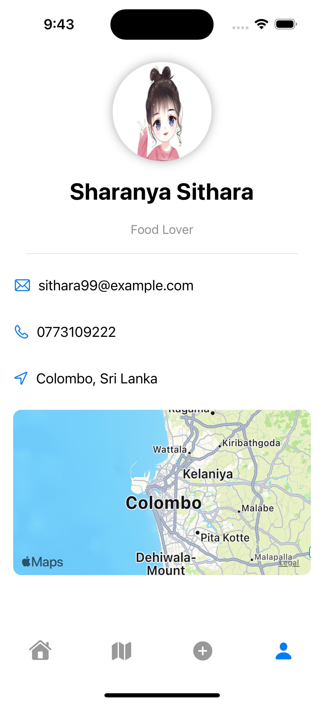
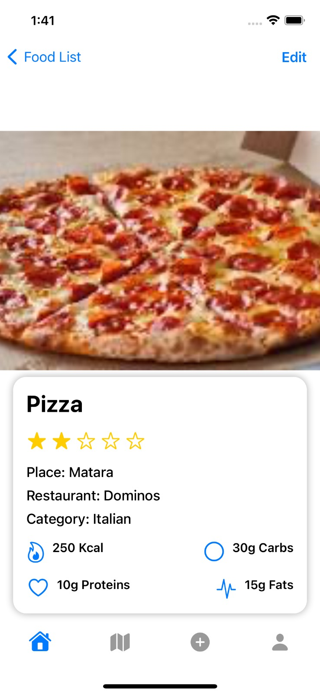

[](https://classroom.github.com/a/sHz1bMKn)
Please go under edit and edit this file as needed for your project. There is no seperate documentation needed.

# Project Name - My Foodie App

# Student Id - IT20104108

# Student Name - Dissanayake D.M.A.A

#### 01. Brief Description of Project - The "My Foodie App" is a user-friendly mobile application designed to cater to food enthusiasts and help them organize and explore their culinary preferences. With this app, users can save and manage a personalized collection of their favorite foods, along with relevant information such as the restaurants or places where they can be found.

#### The app provides a comprehensive selection of food categories, including traditional, Italian, Indian, Chinese, and others. Users can easily browse through these categories to discover new dishes and explore various cuisines. Each category showcases a wide range of mouth-watering options, allowing users to delve into their preferred culinary styles.

#### Within each category, the app offers a rich database of food items, complete with descriptions, images, and user ratings. Users can save their preferred foods to their personal profiles, creating a curated list of favorites for future reference. Additionally, the app allows users to add restaurants and specific locations where each food item can be enjoyed, ensuring an enhanced dining experience.

#### Whether users are searching for their favorite traditional dishes or venturing into new culinary territories, the My Foodie App serves as a reliable and convenient tool for managing, discovering, and savoring a wide array of delectable foods.

#### 02. Users of the System - Culinary Enthusiasts, Restaurant Goers, Food Enthusiasts, Food Bloggers/Influencers

#### 03. What is unique about your solution - The "My Foodie App" offers a unique and comprehensive solution for food lovers by combining features that streamline the process of saving and exploring favorite foods. Unlike other food apps, this app not only allows users to save their preferred dishes but also enables them to add restaurants and specific locations where these foods can be found. Overall, the "My Foodie App" stands out by offering a holistic approach to food exploration, combining a user-friendly interface, extensive food categories, personalized favorites, location-specific information, and a social community of food enthusiasts.

#### 04. Differences of Assignment 02 compared to Assignment 01 - Assignment 01 , and this is based on . in this app I used maps to display restaurants around srilanka as well.

Assignment 1 | Assignment 2

1. Implemented yoga app | Implemented food app
2. Used UIKit | Used SwiftUi
3. Implement Fully functional CRUD | Implement Fully funtional CRUD and MapKit

#### 05. Briefly document the functionality of the screens you have (Include screen shots of images)

e.g. The first screen is used to capture a photo and it will be then processed for identifying the landmarks in the photo.

  
  
  
  
  
  


#### 06. Give examples of best practices used when writing code

e.g The code below uses consistant naming conventions for variables, uses structures and constants where ever possible. (Elaborate a bit more on what you did)

```
  var food: Food

    @State private var name: String
    @State private var place: String
    @State private var category: String
    @State private var restaurant: String
    @State private var rating : Double
    @State private var selectedimage: Data
    @State private var selectedItems: [PhotosPickerItem] = []
    @State private var selectedDate = Date()

    init(food: Food) {
        self.food = food
        _name = State(initialValue: food.name ?? "")
        _place = State(initialValue: food.place ?? "")
        _restaurant = State(initialValue: food.restaurant ?? "")
        _category = State(initialValue: food.category ?? "")
        _selectedDate = State(initialValue: food.date ?? Date())
        _rating = State(initialValue: food.rating)
        _selectedimage = State(initialValue: food.selectedimage ?? Data(count: 0))
    }
        var body: some View {
        VStack {
            Text("Edit Information")
                .font(.title.bold())
        Form {
        Section {
            TextField("Food Name", text: $name)
        }

        Section {
            TextField("Place", text: $place)
        }

        Section {
            TextField("Restaurant", text: $restaurant)
        }

        Section {
            HStack {
                Text("Rating: \(Int(rating))")
                Slider(value: $rating, in: 0...5, step: 1)
            }
            .padding()
        }

        Section {
            DatePicker("Date", selection: $selectedDate, displayedComponents: .date)
        }

        Section {
            HStack {
                Spacer()

                PhotosPicker(selection: $selectedItems,
                             maxSelectionCount: 1,
                             matching: .images) {
                    if let uiImage = selectedimage?.asUIImage() {
                        Image(uiImage: uiImage)
                            .renderingMode(.original)
                            .resizable()
                            .frame(width: 200, height: 200)
                            .cornerRadius(8)
                            .shadow(radius: 5)
                    } else {
                        Image(systemName: "photo")
                            .resizable()
                            .frame(width: 100, height: 100)
                            .cornerRadius(8)
                            .shadow(radius: 5)
                            .foregroundColor(.gray)
                    }
                }

                Spacer()
            }
        }

        Section {
            Picker("Category", selection: $category) {
                ForEach(categories, id: \.self) { category in
                    Text(category)
                }
            }
        }

        Section {
            HStack {
                Button(action: {
                    updateFood()
                    dismiss()
                }) {
                    Text("Modify")
                }
                .buttonStyle(.borderedProminent)
                .disabled(isModificationDisabled)

                Spacer()

                Button(action: {
                    dismiss()
                }) {
                    Text("Cancel")
                }
                .buttonStyle(.borderedProminent)
            }
        }
    }
    .padding(.top, 16)
    .padding(.horizontal)
}

func updateFood() {
    guard let items = selectedItems.first else { return }

    items.loadTransferable(type: Data.self) { result in
        switch result {
        case .success(let data):
            if let data = data {
                food.selectedimage = data
            } else {
                print("No data :(")
            }
        case .failure(let error):
            fatalError("\(error)")
        }
    }

    // Update the existing Food object instead of creating a new one
    food.name = name
    food.date = selectedDate
    food.place = place
    food.restaurant = restaurant
    food.category = category
    food.rating = rating

    // Save the changes
    try! managedObjContext.save()
}

var isModificationDisabled: Bool {
    return name.count <= 2 || place.count <= 2 || selectedimage == nil
}

```

#### 07. UI Components used

1).Tab View
2).Map View  
3).Photos Card view 
4).Landing Page Component 
5).Snaps List
6).Scroll view (Horizontally and Vertically)

#### 08. Testing carried out

```
     var dataController: DataController!
       var context: NSManagedObjectContext!
       
       override func setUp() {
           super.setUp()
           
           dataController = DataController()
           context = dataController.container.viewContext
       }
       
       override func tearDown() {
           super.tearDown()
           
           // Clean up the Core Data objects
           let fetchRequest: NSFetchRequest<NSFetchRequestResult> = NSFetchRequest(entityName: "Food")
           let deleteRequest = NSBatchDeleteRequest(fetchRequest: fetchRequest)
           
           do {
               try context.execute(deleteRequest)
               try context.save()
           } catch {
               print("Failed to delete test data: \(error)")
           }
           
           dataController = nil
           context = nil
       }

    func testAddFood() {
        // Given
               let foodName = "Pizza"
               let restaurant = "Italian Pizzeria"
               let place = "New York"
               let category = "Italian"
               let rating = 4.5
               
               // When
               dataController.addFood(name: foodName, restaurant: restaurant, place: place, category: category, rating: rating, context: context)
               
               // Then
               let fetchRequest: NSFetchRequest<Food> = Food.fetchRequest()
               
               do {
                   let foods = try context.fetch(fetchRequest)
                   
                   XCTAssertEqual(foods.count, 1)
                   
                   let food = foods.first
                   
                   XCTAssertEqual(food?.name, foodName)
                   XCTAssertEqual(food?.restaurant, restaurant)
                   XCTAssertEqual(food?.place, place)
                   XCTAssertEqual(food?.category, category)
                   XCTAssertEqual(food?.rating, rating)
                   
               } catch {
                   XCTFail("Failed to fetch food: \(error)")
               }
    }

    func testEditFood() {
        // Given
        let foodName = "Burger"
        let restaurant = "Fast Food Joint"
        let place = "Chicago"
        let category = "American"
        let rating = 4.0
        
        let food = Food(context: context)
        food.name = "Pizza"
        food.id = UUID()
        food.place = "New York"
        food.category = "Italian"
        food.restaurant = "Italian Pizzeria"
        food.date = Date()
        food.rating = 4.5
        
        try? context.save()
        
        // When
        dataController.editFood(food: food, name: foodName, restaurant: restaurant, place: place, category: category, rating: rating, context: context)
        
        // Then
        XCTAssertEqual(food.name, foodName)
        XCTAssertEqual(food.restaurant, restaurant)
        XCTAssertEqual(food.place, place)
        XCTAssertEqual(food.category, category)
        XCTAssertEqual(food.rating, rating)
    }
```

#### 09. Documentation

(a) Design Choices

- Slider: The slider control can be used to allow users to select the number of tasks to be displayed on the screen at one time. This helps to optimize the user's experience by reducing clutter and allowing for a more focused view of tasks.
- Search bar: A search bar can be implemented to enable users to search for specific tasks based on keywords. This can save time and effort by quickly locating a specific task.
- Color-coded labels: Color-coded labels can be used to differentiate the priority level of each task. This helps users easily identify the urgency of each task and prioritize accordingly.
- Simple and intuitive UI: A simple and intuitive user interface can enhance the user's experience by reducing confusion and making the application easy to navigate.

(b) Implementation Decisions
Using Xcode and Swift: The application will be developed using Xcode, an integrated development environment (IDE) for macOS, and Swift, a powerful and intuitive programming language for iOS development.
• Utilizing SwiftUI framework: The application's user interface will be built using the SwiftUI framework, which provides a set of user interface elements and tools for building native iOS applications.
• Creating a data model: A data model will be created to manage the application's data, including tasks and their associated properties, such as task name, due date, priority level, and completion status.
• Implementing a Core Data stack: To store and manage the application's data, a Core Data stack will be implemented. This will allow for efficient data management, including data persistence and retrieval.
• Implementing a slider: The slider will be used to allow users to select the number of tasks to be displayed on the screen at one time.
• Implementing a search bar: The search bar will be implemented to enable users to search for specific tasks based on keywords.
• Implementing color-coded labels: Color-coded labels will be used to differentiate the priority level of each task, providing users with an easy way to identify the urgency of each task.
• Creating a simple and intuitive user interface: The user interface will be designed to be simple and intuitive, allowing users to efficiently manage their tasks without confusion or difficulty.

(c) Challenges
• Performance: Virtual machines typically have limitations in terms of processing power, memory, and graphics capabilities. iOS app development, especially when using resource-intensive tools like Xcode and running simulators, may require substantial system resources. The performance of the VM can be affected, leading to slower build times, lags, or crashes.
• Simulators : Running iOS simulators within a VM can be resource-intensive and may not accurately reflect the performance and behavior of apps on actual iOS devices
• Debugging and Profiling: Debugging and profiling an iOS app within a VM can be more complex. Connecting to and troubleshooting issues with simulators or physical devices may require additional configuration or workarounds. This can hinder the efficiency of the debugging process.
• VM Stability and Maintenance: Virtual machines can sometimes encounter stability issues, crashes, or performance degradation over time. Regular maintenance, updates, and ensuring compatibility with the latest macOS and Xcode versions can become more challenging within a VM environment.

#### 10. Additional iOS Library used

- PhotoUI
- MapKit

A brief description on how you addressed the last part of the marking rubric.

#### 11. Reflection of using SwiftUI compared to UIKit

SwiftUI

1. Easier state management with the @State property wrapper, which updates views immediately when the state changes.
2. Simple to use
3. Requires less code, which leads to better code readability and simpler maintenance.
   Reflection of using SwiftUI compared to UIKit

#### 12. Reflection General

• Compatibility Issues: Because different devices and operating systems have varied hardware specs and needs, developing a mobile app that works across many devices and operating systems can be difficult.

• Technical Difficulty: Creating a mobile app necessitates a high degree of technical proficiency in coding languages such as Swift and Xcode. For inexperienced developers unfamiliar with these programming languages, this can be a considerable difficulty.

• User UI and User Experience: A major part of mobile app development is creating a visually appealing and user-friendly UI that gives a fantastic user experience. This demands a detailed understanding of user behaviour and preferences, which might be difficult to achieve.

Challenges that you faced in doing the assingment (other than know technical issues of getting hold of a proper Mac machine).
How would have approached this Assignment differently
